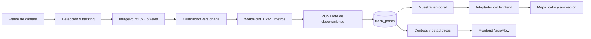
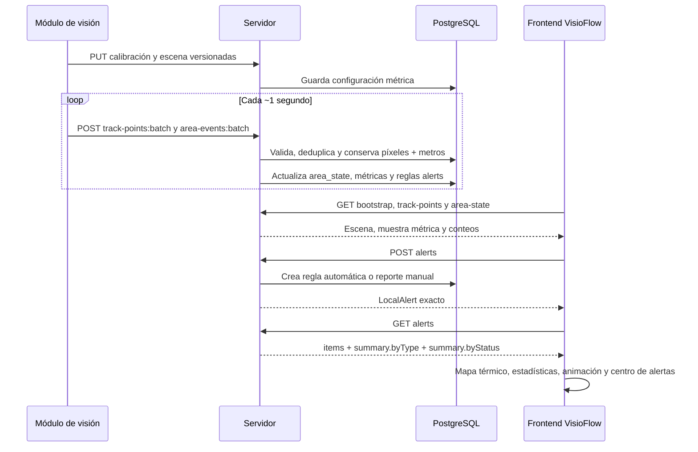

# Especificación única del servidor VisioFlow v1

Este es el único documento humano que debe usar el equipo para construir el
servidor. El contrato ejecutable está en `docs/openapi.yaml`, la persistencia en
`database/schema.sql` y los tipos que consume la app en `src/apiContract.ts`.
Si una implementación contradice esos archivos, se corrige antes de integrarla.

## 1. Convenciones obligatorias

- Prefijo HTTP: `/api/v1`.
- JSON público en `camelCase`; PostgreSQL en `snake_case`.
- Fechas y horas: ISO 8601 UTC, por ejemplo `2026-08-02T18:30:14.125Z`;
  PostgreSQL usa `TIMESTAMPTZ`.
- `siteId`, `cameraId`, `areaId` y `objectId` son strings externos estables. Los
  UUID internos de PostgreSQL no se exponen para esos recursos.
- Un track se identifica con `(cameraId, sessionId, trackerId)`. `trackerId` es
  temporal y nunca representa identidad humana.
- Los nombres de alertas son exactamente los de `LocalAlert`. No crear aliases
  como `alertId`, `alertType`, `scheduleWeekday` o `alert_rules`.

## 2. Coordenadas: píxeles, metros y presentación

No se debe guardar solamente `cx INT` y `cy INT`. Se preservan los dos sistemas
de coordenadas y la proyección de pantalla se calcula después.

| JSON | PostgreSQL | Tipo | Significado |
| --- | --- | --- | --- |
| `imagePoint.u` | `track_points.image_u` | `number` / `DOUBLE PRECISION` | píxel horizontal del punto de los pies |
| `imagePoint.v` | `track_points.image_v` | `number` / `DOUBLE PRECISION` | píxel vertical del punto de los pies |
| `worldPoint.x` / respuesta `x` | `track_points.x_meters` | `number` / `DOUBLE PRECISION` | posición lateral real en metros |
| `worldPoint.y` / respuesta `y` | `track_points.y_meters` | `number` / `DOUBLE PRECISION` | distancia real hacia delante en metros |
| `worldPoint.z` / respuesta `z` | `track_points.z_meters` | `number` / `DOUBLE PRECISION` | altura; normalmente `0` para los pies |
| `positionValid` | `track_points.position_valid` | `boolean` / `BOOLEAN` | autoriza usar la posición métrica |

El mundo usa `world_ground`: X a la derecha, Y hacia delante y Z hacia arriba,
todo en metros. Cuando `positionValid=false`, `worldPoint` debe ser `null` y ese
punto no participa en mapas métricos ni estadísticas espaciales. `imagePoint`
puede conservarse para diagnóstico.

El frontend conserva los metros como `worldX/worldY/worldZ` y los píxeles como
`imageU/imageV`. Para dibujar, deriva `TrackPoint.x/y` sobre un lienzo `100 × 68`.
Esa proyección visual nunca reemplaza el dato original.



## 3. Datos que sube el módulo de visión

### 3.1 Registrar cámara

`PUT /api/v1/sites/{siteId}/cameras/{cameraId}` registra nombre, modo de sensor
(`rgbd`, `stereo` o `monocular`) y estado activo. El servidor resuelve los IDs
externos a UUID internos.

### 3.2 Subir calibración

`PUT /api/v1/sites/{siteId}/cameras/{cameraId}/calibrations/{version}` se llama
únicamente cuando se aprueba una versión nueva. Conserva matrices intrínsecas,
distorsión, transformación al mundo, homografía del suelo, resolución de imagen,
método, error de reproyección y fecha de calibración. Una webcam RGB normal
funciona en modo `monocular`; necesita una calibración ChArUco o una homografía
equivalente para producir metros.

### 3.3 Subir escena

`PUT /api/v1/sites/{siteId}/cameras/{cameraId}/scenes/{version}` se llama cuando
cambian el campo de visión, las áreas u objetos fijos. La escena contiene:

- `coordinateSystem.name = world_ground`, `unit = meter`;
- `calibrationVersion` usada;
- `fieldOfViewPolygon` como pares `[x,y]` métricos;
- `operationalAreas` con `areaId`, `name`, `kind`, `polygon` y `bounds`;
- `objects` con huella métrica, dimensiones, método de profundidad y confianza.

### 3.4 Abrir y cerrar sesión de tracking

- `POST /api/v1/ingest/sessions`: crea una sesión para un arranque del tracker.
- `PATCH /api/v1/ingest/sessions/{sessionId}`: registra su cierre.

Cada arranque genera un `sessionId` UUID distinto; así un `trk-184` reutilizado
no se confunde con el mismo número de otra cámara o sesión.

### 3.5 Subir observaciones

`POST /api/v1/ingest/track-points:batch`

```json
{
  "batchId": "252bd3fc-2287-4893-abfe-8ab13436a5c8",
  "siteId": "tienda-centro",
  "cameraId": "cam-03",
  "sessionId": "90c347ab-c49e-44e4-bc9f-c6aec038749d",
  "calibrationVersion": 2,
  "sceneVersion": 4,
  "coordinateSystem": "world_ground",
  "points": [
    {
      "frameId": 158420,
      "trackerId": "trk-184",
      "capturedAt": "2026-08-02T18:30:14.125Z",
      "imagePoint": { "u": 824.5, "v": 591.0 },
      "worldPoint": { "x": 2.31, "y": 4.72, "z": 0.0 },
      "confidence": 0.93,
      "positionValid": true,
      "areaId": "central"
    }
  ]
}
```

| Campo | Tipo/regla | Uso |
| --- | --- | --- |
| `batchId` | UUID | idempotencia del reintento |
| `siteId`, `cameraId` | string | origen autorizado |
| `sessionId` | UUID | arranque concreto del tracker |
| `calibrationVersion`, `sceneVersion` | integer | versiones que produjeron el punto |
| `points` | 1 a 5000 elementos | observaciones del intervalo |
| `frameId` | entero de 64 bits | frame dentro de la cámara |
| `trackerId` | string `trk-<entero>` | track temporal |
| `capturedAt` | fecha UTC | instante original, no el de recepción |
| `confidence` | decimal `0..1` | confianza de detección |
| `areaId` | string o `null` | área semántica de la escena |

Frecuencia: visión puede procesar todos los frames; acumula aproximadamente un
segundo y envía un lote cada segundo o al llegar a 5000 puntos. Un reintento usa
el mismo `batchId`. PostgreSQL conserva la frecuencia original.

### 3.6 Subir eventos de área

`POST /api/v1/ingest/area-events:batch`, normalmente cada segundo junto con las
observaciones.

```json
{
  "batchId": "07e75e4e-ce53-43a8-af77-4d7fc75e00e1",
  "siteId": "tienda-centro",
  "cameraId": "cam-03",
  "sessionId": "90c347ab-c49e-44e4-bc9f-c6aec038749d",
  "calibrationVersion": 2,
  "sceneVersion": 4,
  "events": [{
    "eventId": "2bd21701-c11c-45f9-a0f6-b83cd4815680",
    "trackerId": "trk-184",
    "areaId": "central",
    "eventType": "exit",
    "capturedAt": "2026-08-02T18:31:02.125Z",
    "dwellSeconds": 48.0
  }]
}
```

`eventType` sólo admite `enter` o `exit`; un `enter` lleva `dwellSeconds=0`.

## 4. Base de datos concordante

`database/schema.sql` define las columnas exactas. Este es su mapa funcional:

| Tabla | Datos principales |
| --- | --- |
| `users` | username, hash de contraseña, nombre, estado y timestamps |
| `sites` | `external_id`, nombre, zona horaria y estado |
| `site_memberships` | usuario, sitio y rol |
| `cameras` | `external_id`, sitio, nombre, modo de sensor y estado |
| `camera_calibrations` | cámara, versión, matrices, homografía, resolución, método y errores |
| `scenes` | cámara, versión, calibración, sistema de coordenadas, FOV y estado |
| `areas` | escena, `external_id`, nombre, tipo, polígono y bounds métricos |
| `static_objects` | escena, `external_id`, nombre, tipo, huella, centro y dimensiones |
| `tracking_sessions` | sesión, cámara, versiones, inicio y cierre |
| `ingestion_batches` | `batch_id`, clase, hash, cantidades y estado de cada lote |
| `track_points` | frame, track, UTC, píxeles, metros, validez, área y confianza |
| `area_events` | evento, track, área, entrada/salida, UTC y permanencia |
| `area_state` | conteo vigente derivado por cámara y área |
| `area_hourly_metrics` | tracks, visitas, permanencia, detenidos y pico por área/hora |
| `alerts` | recurso unificado que coincide con `LocalAlert` |

El servidor debe deduplicar lotes por `batch_id` y puntos por
`(camera_id, tracking_session_id, frame_id, track_id)`. `area_state` se deriva de
los tracks aceptados; no se toma un conteo externo como verdad final.

### 4.1 Tabla `alerts`: correspondencia exacta

| Frontend/API | PostgreSQL | Tipo | Regla |
| --- | --- | --- | --- |
| `id` | `id` | UUID/string | generado por servidor |
| `areaId` | `area_id` | string externo / UUID FK | área elegida |
| `areaName` | join `areas.name` | string | generado en respuesta |
| `type` | `type` | enum string | cinco valores exactos |
| `reason` | `reason` | string / `VARCHAR(300)` | 10 a 300 caracteres |
| `status` | `status` | enum string | estado actual |
| `thresholdPeople` | `threshold_people` | integer nullable | `1..120`, sólo reglas de flujo |
| `scheduleMode` | `schedule_mode` | enum string | forma de programación |
| `scheduleDay` | `schedule_day` | integer nullable | `0=Lun ... 6=Dom` |
| `scheduleDate` | `schedule_date` | `YYYY-MM-DD` nullable | fecha local del sitio |
| `peopleCountSnapshot` | `people_count_snapshot` | integer | conteo calculado por servidor |
| `createdBy` | join `users.username` | string | usuario autenticado |
| `createdAt` | `created_at` | ISO UTC / `TIMESTAMPTZ` | generado por servidor |

## 5. Datos que consulta el frontend

| Petición | Respuesta/uso | Frecuencia recomendada |
| --- | --- | --- |
| `GET /sites/{siteId}/bootstrap` | sitio, cámaras, áreas, escenas y objetos | al iniciar o cambiar escena |
| `GET /sites/{siteId}/track-points?from=&to=&sampleSeconds=4` | mapa térmico, recorridos y animación | cada 2–4 s en vivo |
| `GET /sites/{siteId}/area-state` | conteo actual por área | cada 2–4 s |
| `GET /sites/{siteId}/area-events?from=&to=` | entradas, salidas y permanencia | cada 5–15 s o al abrir historial |
| `GET /sites/{siteId}/analytics/summary?from=&to=` | KPIs del periodo | al cambiar periodo |
| `GET /sites/{siteId}/analytics/area-hours?from=&to=` | desglose área–hora | al abrir análisis/cambiar filtros |
| `GET /sites/{siteId}/alerts` | alertas y desglose | cada 5–15 s y tras crear/modificar |

Las listas usan `limit`, `cursor` y devuelven `nextCursor`; `null` significa fin.
El endpoint de puntos devuelve por defecto una muestra uniforme de un punto por
tracker cada cuatro segundos. Los cálculos oficiales usan todos los puntos
válidos conservados, no sólo esa muestra.

Ejemplo de punto que descarga el frontend:

```json
{
  "cameraId": "cam-03",
  "sessionId": "90c347ab-c49e-44e4-bc9f-c6aec038749d",
  "frameId": 158420,
  "trackerId": "trk-184",
  "capturedAt": "2026-08-02T18:30:14.125Z",
  "imagePoint": { "u": 824.5, "v": 591.0 },
  "x": 2.31,
  "y": 4.72,
  "z": 0.0,
  "areaId": "central",
  "confidence": 0.93
}
```

## 6. Alertas: contrato exacto del frontend

El frontend usa un único recurso y una única forma `LocalAlert`:

```ts
type AlertType =
  | 'crowding'
  | 'low_flow'
  | 'unusual_dwell'
  | 'blocked_access'
  | 'manual';

type AlertScheduleMode = 'immediate' | 'all_days' | 'weekly' | 'date';
type AlertStatus = 'new' | 'watching' | 'triggered' | 'acknowledged' | 'resolved';

type LocalAlert = {
  id: string;
  areaId: string;
  areaName: string;
  type: AlertType;
  reason: string;
  status: AlertStatus;
  thresholdPeople?: number;
  scheduleMode?: AlertScheduleMode;
  scheduleDay?: number;
  scheduleDate?: string;
  peopleCountSnapshot: number;
  createdBy: string;
  createdAt: string;
};
```

### 6.1 Significado de cada tipo

| `type` | Tipo de registro | Condición/uso | Estado inicial |
| --- | --- | --- | --- |
| `crowding` | regla automática | dispara si `peopleCount >= thresholdPeople` | `triggered` si cumple; si no `watching` |
| `low_flow` | regla automática | dispara si `peopleCount <= thresholdPeople` | `triggered` si cumple; si no `watching` |
| `unusual_dwell` | reporte manual | permanencia inusual observada | `new` |
| `blocked_access` | reporte manual | acceso bloqueado observado | `new` |
| `manual` | reporte manual | otro hecho escrito por el operador | `new` |

### 6.2 Programación

| `scheduleMode` | Campos permitidos | Aplicación |
| --- | --- | --- |
| `immediate` | sin día ni fecha | sólo reportes manuales |
| `all_days` | sin día ni fecha | regla activa todos los días |
| `weekly` | `scheduleDay` obligatorio | `0=Lun`, `1=Mar`, ..., `6=Dom` |
| `date` | `scheduleDate` obligatorio | fecha `YYYY-MM-DD` en zona horaria del sitio |

`crowding` y `low_flow` requieren `thresholdPeople` entre 1 y 120 y uno de
`all_days`, `weekly` o `date`. Los otros tres tipos requieren `immediate` y no
aceptan umbral.

### 6.3 POST del frontend: crear regla automática

`POST /api/v1/sites/{siteId}/alerts`

```json
{
  "areaId": "central",
  "type": "crowding",
  "reason": "Avisar cuando haya 20 personas o más.",
  "thresholdPeople": 20,
  "scheduleMode": "weekly",
  "scheduleDay": 3
}
```

### 6.4 POST del frontend: crear reporte manual

La misma ruta, sin un endpoint alterno:

```json
{
  "areaId": "access",
  "type": "blocked_access",
  "reason": "El acceso principal está obstruido por mercancía.",
  "scheduleMode": "immediate"
}
```

El cliente no envía `id`, `areaName`, `status`, `peopleCountSnapshot`,
`createdBy` ni `createdAt`. El servidor los calcula y responde `201` con la forma
exacta de `LocalAlert`:

```json
{
  "id": "47920d3a-33a7-419e-a7d5-a9d30b9de93d",
  "areaId": "central",
  "areaName": "Mesa temporada",
  "type": "crowding",
  "reason": "Avisar cuando haya 20 personas o más.",
  "status": "watching",
  "thresholdPeople": 20,
  "scheduleMode": "weekly",
  "scheduleDay": 3,
  "peopleCountSnapshot": 14,
  "createdBy": "operador",
  "createdAt": "2026-08-02T18:30:14.125Z"
}
```

Los campos opcionales que no aplican pueden omitirse; no deben cambiar de nombre.

### 6.5 GET de alertas y desglose por tipo

`GET /api/v1/sites/{siteId}/alerts?areaId=&type=&status=&limit=&cursor=`

`areaId`, `type` y `status` son filtros opcionales. `summary` cuenta el resultado
completo después de filtros, no solamente la página de `items`.

```json
{
  "items": [
    {
      "id": "47920d3a-33a7-419e-a7d5-a9d30b9de93d",
      "areaId": "central",
      "areaName": "Mesa temporada",
      "type": "crowding",
      "reason": "Avisar cuando haya 20 personas o más.",
      "status": "watching",
      "thresholdPeople": 20,
      "scheduleMode": "weekly",
      "scheduleDay": 3,
      "peopleCountSnapshot": 14,
      "createdBy": "operador",
      "createdAt": "2026-08-02T18:30:14.125Z"
    }
  ],
  "summary": {
    "total": 12,
    "byType": {
      "crowding": 3,
      "low_flow": 2,
      "unusual_dwell": 2,
      "blocked_access": 1,
      "manual": 4
    },
    "byStatus": {
      "new": 4,
      "watching": 3,
      "triggered": 2,
      "acknowledged": 1,
      "resolved": 2
    }
  },
  "nextCursor": null
}
```

Las cinco claves de `byType` y las cinco de `byStatus` siempre aparecen, aunque
su valor sea `0`. Esto evita condicionales y nombres distintos en el frontend.

### 6.6 PATCH de estado

`PATCH /api/v1/sites/{siteId}/alerts/{id}`

```json
{ "status": "acknowledged" }
```

También admite `resolved`. Responde `200` con el `LocalAlert` completo y
actualizado. La ruta usa `{id}`, igual que el campo `id` del frontend.

### 6.7 Evaluación que realiza el servidor

1. Obtiene `peopleCount` vigente de `area_state` para el área.
2. Evalúa la fecha con la zona horaria de `sites.timezone`.
3. Si la programación no aplica, conserva `watching`.
4. Para `crowding`, cumple cuando `peopleCount >= thresholdPeople`.
5. Para `low_flow`, cumple cuando `peopleCount <= thresholdPeople`.
6. Cambia `watching` a `triggered` al cumplir y vuelve a `watching` si deja de
   cumplir; no revierte estados puestos por usuario (`acknowledged`, `resolved`).
7. Actualiza `peopleCountSnapshot` con el conteo usado en la última evaluación.
8. En creación, obtiene `areaName` de `areas.name` y `createdBy` del username del
   usuario autenticado. Nunca confía en esos valores enviados por el cliente.

## 7. Secuencia completa



## 8. Validaciones mínimas de aceptación

1. Validar cuerpos y respuestas contra `docs/openapi.yaml`.
2. Resolver IDs externos y comprobar que pertenecen al mismo sitio/escena.
3. Reintentar un lote con el mismo `batchId` sin duplicar filas; contenido
   diferente bajo el mismo UUID responde `409`.
4. No mezclar `u/v` de imagen con `x/y/z` métricos.
5. No usar posiciones métricas marcadas como inválidas.
6. Paginar consultas sin perder la identidad `(camera, session, tracker)`.
7. Mantener los nombres de `LocalAlert` exactamente, incluidos `type`,
   `scheduleDay` e `id`.
8. Probar los cinco tipos y cinco estados, incluyendo conteos cero en `summary`.
9. Probar umbrales inclusivos (`>=` y `<=`) y los cuatro modos de programación.
10. Confirmar que mapas, animación y estadísticas reciben metros preservados y
    que el muestreo de descarga no altera los datos originales.
