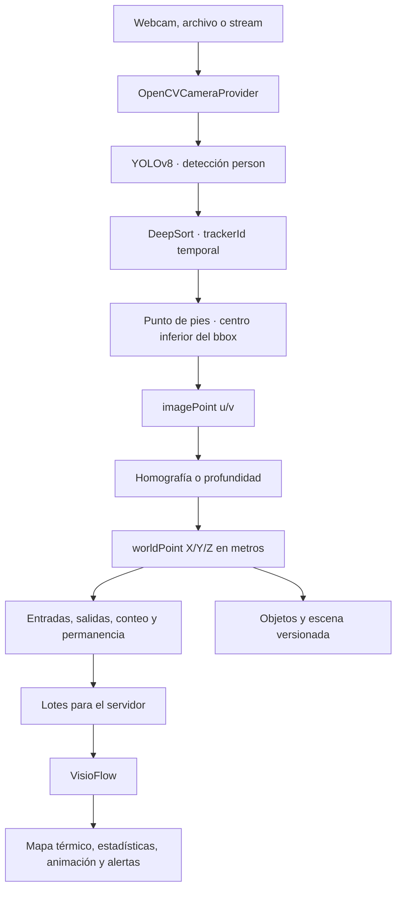
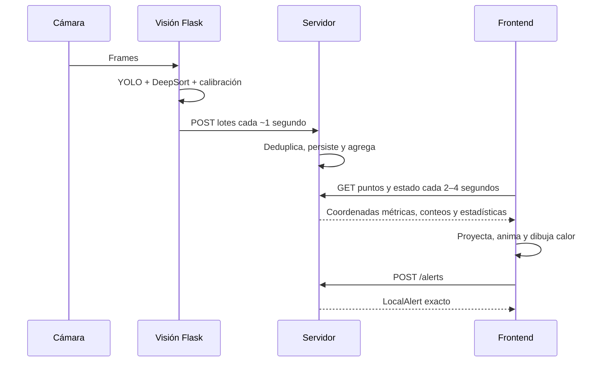

# Tutorial completo: ejecutar, calibrar y operar VisioFlow

Esta guía cubre los dos proyectos que están actualmente en el escritorio:

- módulo de visión Flask: `C:\Users\luisi\Desktop\PI\contador_personas_flask`;
- frontend Expo: `C:\Users\luisi\Desktop\visioflow`.

El módulo Flask captura video, detecta y rastrea personas, convierte píxeles a
metros y prepara eventos. El frontend representa recorridos, mapas térmicos,
estadísticas, animaciones y alertas. El servidor definido en
`docs/server-specification.md` será el enlace persistente entre ambos.

## 1. Qué se necesita

### Equipo

- Windows 10 u 11.
- Python 3.11 recomendado.
- Node.js 22.13 o 24.3 o posterior compatible con Expo 54.
- Una webcam normal USB o integrada.
- Trípode o soporte rígido para dejar la cámara inmóvil.
- Impresora, regla y cinta métrica.
- Un tablero ChArUco impreso.
- Para abrir el frontend en teléfono: Expo Go y teléfono/PC en la misma red.

### Regla física más importante

La cámara se instala primero en su posición definitiva. No debe moverse después
de calibrar. Si cambia de altura, inclinación, posición, zoom, enfoque o
resolución, la calibración correspondiente deja de ser confiable.

## 2. Abrir las carpetas

En el Explorador de Windows:

1. Abre `C:\Users\luisi\Desktop\PI\contador_personas_flask` para visión.
2. Abre `C:\Users\luisi\Desktop\visioflow` para el frontend.
3. En cada carpeta puedes hacer clic derecho en un espacio vacío y seleccionar
   **Abrir en Terminal**.

Conviene usar dos terminales: una para Flask y otra para Expo. Cuando exista el
servidor, se ejecutará en una tercera terminal.

## 3. Ejecutar el frontend VisioFlow

### Primera ejecución

En PowerShell:

```powershell
cd C:\Users\luisi\Desktop\visioflow
npm install
```

Después haz doble clic en:

```text
C:\Users\luisi\Desktop\visioflow\iniciar-visioflow.bat
```

Elige:

- `1 LAN`: teléfono y PC están en el mismo Wi-Fi; es la opción más rápida.
- `2 Túnel`: están en redes distintas; tarda más.

Escanea el QR con Expo Go. Para abrirlo directamente en el navegador:

```powershell
cd C:\Users\luisi\Desktop\visioflow
npm run web
```

El frontend de demostración usa:

```text
Usuario: operador
Contraseña: visioflow
```

Actualmente sus recorridos y estadísticas salen del conjunto determinístico de
demostración de `src/data.ts`; las alertas se guardan localmente mediante
AsyncStorage. Al conectar el servidor, esos orígenes se sustituyen por las rutas
descritas en `docs/server-specification.md`.

### Controles principales del frontend

- **Reproducir/Pausar** mueve las personas a lo largo de la jornada.
- La línea de tiempo cambia el instante visible.
- El selector de día cambia mapa, indicadores y análisis al mismo día.
- Tocar un área abre sus métricas, hora pico y comparación.
- **Análisis** abre tendencias por hora, día y semana.
- **Alertas** permite crear reglas automáticas o reportes manuales.
- Las capas del mapa permiten mostrar calor, recorridos y personas activas.

## 4. Ejecutar el módulo de visión Flask

### 4.1 Crear el entorno Python

En otra terminal PowerShell:

```powershell
cd C:\Users\luisi\Desktop\PI\contador_personas_flask
py -3.11 -m venv .venv
Set-ExecutionPolicy -Scope Process Bypass
.\.venv\Scripts\Activate.ps1
python -m pip install --upgrade pip
pip install -r requirements.txt
```

La primera instalación puede tardar porque incluye PyTorch, Ultralytics,
OpenVINO, OpenCV contrib y DeepSort.

### 4.2 Configurar una webcam normal

En la misma terminal, antes de iniciar Flask:

```powershell
$env:FLASK_SECRET_KEY = "CAMBIA-ESTA-CLAVE-POR-UNA-LARGA-Y-ALEATORIA"
$env:APP_ENV = "local"
$env:CAMERA_SOURCE = "0"
$env:SENSOR_MODE = "monocular"
$env:CAMERA_ID = "cam-01"
$env:VISIOFLOW_API_BASE_URL = "http://localhost:8000"
$env:FLASK_DEBUG = "0"
python run.py
```

`CAMERA_SOURCE=0` selecciona la primera webcam. Si hay varias, prueba `1` o `2`.
También puede ser la ruta absoluta de un video o la URL de un stream compatible
con OpenCV.

Se usa `APP_ENV=local` para que la cookie de sesión funcione sobre HTTP local.
En un entorno no local debe usarse la configuración segura correspondiente.

### 4.3 Comprobar que arrancó

Abre:

```text
http://localhost:5000/health
```

Debe responder JSON. Los indicadores principales son:

- `status: "ok"`: Flask está vivo;
- `vision.cameraReady: true`: la webcam abrió;
- `engine_ready: true`: YOLO y DeepSort terminaron de cargar.

La primera ejecución puede tardar varios minutos porque intenta exportar
YOLOv8n a OpenVINO. No cierres la terminal mientras aparece el mensaje de carga.

### 4.4 Inicio de sesión requerido

Las pantallas `/` y `/configuration` están protegidas. El formulario no valida
usuarios dentro de Flask: llama a `VISIOFLOW_API_BASE_URL/auth/login`.

Por tanto, para usar hoy la interfaz de calibración se necesita un servidor en
`http://localhost:8000` con un usuario administrador y esa ruta de login. Sin él:

- Flask y `/health` pueden ejecutarse;
- la cámara y el motor pueden diagnosticarse en la terminal;
- no será posible entrar legalmente al asistente web de calibración.

Cuando el servidor esté disponible, inicia sesión con el usuario administrador y
abre:

```text
http://localhost:5000/configuration
```

## 5. Preparar e imprimir el tablero ChArUco

### 5.1 Dimensiones exactas configuradas

El código usa estos valores predeterminados:

| Dato | Valor |
| --- | --- |
| Diccionario | `DICT_5X5_100` |
| Cuadros horizontales | `7` |
| Cuadros verticales | `5` |
| Lado de cada cuadro | `0.04 m = 4 cm` |
| Lado de cada marcador | `0.02 m = 2 cm` |
| Tamaño total del patrón | `28 × 20 cm` |
| Capturas mínimas aceptadas | `5` |

`28 cm = 7 × 4 cm` y `20 cm = 5 × 4 cm`.

### 5.2 Generar la imagen

Con el entorno Python de visión activado, ejecuta desde su carpeta:

```powershell
python -c "import cv2; d=cv2.aruco.getPredefinedDictionary(cv2.aruco.DICT_5X5_100); b=cv2.aruco.CharucoBoard((7,5),0.04,0.02,d); cv2.imwrite('charuco-7x5.png',b.generateImage((2800,2000),marginSize=0,borderBits=1))"
```

Se crea `charuco-7x5.png`. Los `2800 × 2000` píxeles sólo proporcionan una
imagen nítida; la escala física se determina al imprimir.

### 5.3 Imprimir sin cambiar la escala

1. Usa preferentemente papel A3 o una hoja que permita `28 × 20 cm` sin recorte.
2. Configura la imagen impresa exactamente a **28 cm de ancho × 20 cm de alto**.
3. Desactiva **Ajustar a página**, **Reducir** o **Escalar automáticamente**.
4. Imprime y mide varios cuadros interiores con una regla.
5. Cada cuadro debe medir exactamente `40 mm`; cada marcador negro, `20 mm`.
6. Pega la hoja completamente plana sobre cartón pluma, acrílico o una tabla
   rígida. No debe doblarse ni ondularse.

A4 mide `29.7 × 21 cm`, pero muchas impresoras no tienen área imprimible
suficiente para `28 × 20 cm`. Si el controlador reduce la imagen, usa A3.

Si el cuadro impreso no mide 40 mm, no uses `0.04` como medida. Mide el lado real
y configura antes de arrancar, por ejemplo para `38.5 mm`:

```powershell
$env:CHARUCO_SQUARE_LENGTH_METERS = "0.0385"
$env:CHARUCO_MARKER_LENGTH_METERS = "0.01925"
```

El marcador debe conservar la mitad del lado del cuadro. Reinicia Flask después
de cambiar estas variables y confirma las medidas mostradas en la pantalla.

## 6. Calibración intrínseca: diferentes posiciones

La calibración intrínseca aprende la óptica: distancia focal, centro de imagen y
distorsión. Durante esta fase la cámara queda inmóvil y se mueve el tablero.

El código acepta desde 5 capturas, pero para una calibración estable usa entre
10 y 15 vistas claramente diferentes.

### Secuencia recomendada de vistas

1. Tablero frontal, centrado, ocupando aproximadamente 50–70 % del frame.
2. Tablero cerca de la esquina superior izquierda.
3. Esquina superior derecha.
4. Esquina inferior izquierda.
5. Esquina inferior derecha.
6. Inclinado hacia atrás unos 20–30 grados.
7. Inclinado hacia delante.
8. Girado hacia la izquierda.
9. Girado hacia la derecha.
10. Una vista más cercana, sin cortar el tablero.
11. Una vista más lejana, pero con marcadores nítidos.
12. Una vista intermedia en una zona con distorsión visible del lente.

No basta con tomar 10 fotografías idénticas. Se necesitan distintas posiciones,
distancias e inclinaciones para observar toda la óptica.

### Capturar y resolver

1. Abre `http://localhost:5000/configuration` como administrador.
2. Busca **2. Intrínsecos ChArUco**.
3. Coloca el tablero en la primera posición y espera a que no haya movimiento.
4. Pulsa **Capturar vista**.
5. Confirma el mensaje `Vista N aceptada` y el número de esquinas.
6. Cambia el tablero a la siguiente posición y repite.
7. Después de 10–15 vistas aceptadas pulsa **Resolver**.

El resultado muestra una versión y el error RMS. El límite configurado es
`1.5 px`; cuanto más bajo, mejor. Si supera el límite, el sistema rechaza la
calibración: mejora iluminación, evita reflejos/desenfoque y repite vistas.

Las imágenes capturadas no se guardan. Sólo se mantienen esquinas detectadas en
memoria hasta resolver. El resultado queda en:

```text
data\calibration\cam-01\intrinsics.json
```

### Cuándo repetir los intrínsecos

Repítelos si cambia:

- la webcam o lente;
- resolución;
- zoom óptico o digital aplicado antes de la detección;
- enfoque fijo de la óptica;
- orientación de imagen, recorte o relación de aspecto.

Mover solamente la cámara conserva matemáticamente la óptica, pero cambia por
completo su relación con el suelo; como procedimiento seguro del proyecto,
después de cualquier movimiento físico ejecuta otra vez el asistente completo.

## 7. Calibrar el plano del mundo

Esta etapa convierte el píxel de los pies `(u,v)` en una posición real `(X,Y)`
en metros. No se realiza moviendo el tablero ChArUco; se realiza midiendo puntos
fijos sobre el suelo.

### 7.1 Definir el origen y los ejes

La convención es:

- origen `(0,0,0)`: proyección vertical de la cámara sobre el suelo;
- X positivo: hacia la derecha visto desde la cámara;
- Y positivo: hacia delante, alejándose de la cámara;
- Z positivo: hacia arriba.

Mide la altura desde el suelo hasta el centro óptico del lente, no hasta el borde
de la carcasa.

### 7.2 Marcar puntos físicos

1. Coloca al menos cuatro marcas de cinta en el suelo; seis u ocho es mejor.
2. Distribúyelas cerca de los bordes y en distintas profundidades del campo de
   visión. No las coloques en una sola línea.
3. Mide X e Y de cada marca desde el origen elegido.
4. Anota las coordenadas métricas con signo.

Ejemplo:

| Marca | X metros | Y metros |
| --- | ---: | ---: |
| A izquierda cercana | `-3` | `1` |
| B derecha cercana | `3` | `1` |
| C derecha lejana | `2` | `8` |
| D izquierda lejana | `-2` | `8` |

### 7.3 Obtener los píxeles de las marcas

En la pantalla de configuración, mueve el cursor exactamente sobre cada marca.
El indicador **Imagen** muestra `u` y `v`. Anota esos dos números en el mismo
orden que sus coordenadas reales.

Edita el JSON de **3. Plano del mundo**:

```json
{
  "cameraHeightMeters": 2.8,
  "originDefinition": "camera_floor_projection",
  "imagePoints": [[100,700],[1100,700],[900,350],[300,350]],
  "worldPoints": [[-3,1],[3,1],[2,8],[-2,8]]
}
```

Las posiciones del ejemplo son ilustrativas. Nunca las copies sin medir tu
instalación. La correspondencia es por índice:

- `imagePoints[0]` corresponde a `worldPoints[0]`;
- `imagePoints[1]` corresponde a `worldPoints[1]`;
- y así sucesivamente.

Pulsa **Resolver pose y homografías**. El límite actual del error de validación es
`0.15 m`. El resultado queda en:

```text
data\calibration\cam-01\world.json
```

### 7.4 Verificación visual

Después de resolver:

- al mover el cursor debe aparecer **Mundo: X=…m, Y=…m**;
- la cuadrícula verde debe seguir la perspectiva real del suelo;
- puntos cercanos a una marca deben producir coordenadas parecidas a la medición;
- el estado debe mostrar intrínsecos y mundo con sus versiones y errores.

Si la cuadrícula cruza paredes, se voltea o las distancias cambian mucho, revisa
el orden de correspondencias, signos de X, medidas y píxeles.

## 8. Qué hacer si se mueve la cámara

| Cambio | Acción mínima |
| --- | --- |
| Se mueve o gira la cámara | repetir calibración del mundo y revisar escena/áreas |
| Cambia la altura | repetir calibración del mundo |
| Cambia zoom, enfoque, resolución o lente | repetir intrínsecos y mundo |
| Se mueve sólo el tablero durante intrínsecos | correcto; es parte del proceso |
| Se mueven muebles, mesas o exhibidores | actualizar escena; no necesariamente la cámara |
| Se cambia la webcam | repetir todo |

Para bloquear operaciones cuando se sabe que la cámara fue movida:

```powershell
$env:CALIBRATION_INVALIDATED = "1"
```

Reinicia Flask. Después de recalibrar correctamente, vuelve a `0` y reinicia.

## 9. Configurar la escena y sus objetos

La calibración define geometría; la escena define qué existe en esa geometría.

### Escaneo automático

1. Deja la escena sin personas moviéndose frente a la cámara.
2. Pulsa **Iniciar** en **4. Escaneo estático**.
3. El sistema recopila entre 30 y 100 frames; el valor predeterminado es 40.
4. Revisa las propuestas estables y desmarca las incorrectas.
5. Pulsa **Aceptar propuestas estables**.

El escaneo sólo produce propuestas útiles si existe un modelo de segmentación
compatible configurado mediante `SCENE_MODEL_PATH` y su mapa de clases. Sin ese
modelo, utiliza el editor manual.

### Crear un objeto manual

1. Escribe un nombre, por ejemplo `Mesa central`.
2. Selecciona clase: `wall`, `table`, `shelf`, `rack`, `display`, `checkout`,
   `bench`, `column` u `other`.
3. Escribe la altura real en metros si la conoces.
4. Pulsa **Dibujar polígono**.
5. Marca al menos tres vértices sobre el contacto del objeto con el suelo.
6. Pulsa **Guardar objeto**.

El sistema transforma cada clic de píxeles a metros con la homografía. Los
vértices naranjas guardados se pueden arrastrar para corregir su posición. La
escena versionada queda en:

```text
data\scenes\cam-01\scene.json
```

## 10. Crear áreas de conteo

En la página principal de Flask:

1. Abre `http://localhost:5000/` como administrador.
2. Escribe el nombre del área.
3. Pulsa **Dibujar área en el video**.
4. Mantén pulsado el ratón, arrastra el rectángulo y suelta.
5. Pulsa **Guardar área**.

La interfaz convierte automáticamente las coordenadas mostradas al tamaño
natural del frame. No escribas manualmente `x1`, `y1`, `x2`, `y2`.

En la implementación actual estas áreas rectangulares viven en memoria y se
intentan registrar en la API heredada `/areas`. Al reiniciar Flask pueden
desaparecer si no existe el servidor. En el servidor definitivo deben convertirse
en `operationalAreas` métricas y persistirse con el contrato v1.

## 11. Prueba operativa completa

1. Confirma `/health` y `cameraReady=true`.
2. Confirma errores aceptables de intrínsecos y mundo.
3. Camina tú solo lentamente por cada área.
4. Comprueba que el rectángulo verde sigue a la persona y aparece un ID.
5. Comprueba que el círculo del punto de los pies cae donde toca el suelo.
6. Observa entradas, salidas y permanencia en la página principal.
7. Mueve el cursor sobre el suelo y compara X/Y con la cinta métrica.
8. Haz una segunda prueba con dos personas que se crucen.
9. Verifica que cada track conserve su recorrido sin saltos grandes.
10. Cuando esté conectado el servidor, abre el frontend y verifica conteos,
    animación, mapa térmico, estadísticas y alertas.

Una grabación genérica sirve para probar detección, tracking y funcionamiento de
la interfaz. No sirve para validar metros reales de una instalación si no se
conocen la cámara, su calibración y las medidas del suelo de ese video.

Para usar un archivo local como fuente:

```powershell
$env:CAMERA_SOURCE = "C:\ruta\absoluta\prueba.mp4"
python run.py
```

El archivo puede terminar y requerir reiniciar el proceso; una webcam es más
adecuada para validar el ciclo continuo.

## 12. Funcionamiento interno del módulo de visión



### Captura

`OpenCVCameraProvider` abre `CAMERA_SOURCE` en un hilo y conserva los frames más
recientes. La cola sólo guarda hasta dos, para no procesar video atrasado.

### Detección

YOLOv8n detecta objetos. El adaptador conserva la clase persona que supera el
umbral de confianza, actualmente `0.35`.

### Tracking

DeepSort relaciona detecciones entre frames. Genera un `trackerId` temporal. El
servidor debe combinar cámara, sesión y tracker para evitar colisiones después
de reinicios.

### Punto de los pies

De cada caja delimitadora se toma el centro del borde inferior. Ese punto es más
apropiado que el centro del cuerpo para proyectarlo al suelo.

### Conversión métrica

- Webcam monocular: aplica `imageToGroundHomography` al punto de los pies.
- RGB-D o estéreo: puede muestrear profundidad alineada y transformar el rayo a
  coordenadas métricas.

Siempre se conservan por separado los píxeles `u/v` y los metros `X/Y/Z`.

### Áreas y eventos

El servicio mantiene por track la última área y el tiempo de entrada. Al cambiar
de área produce salida/entrada, calcula permanencia y actualiza conteos. Los
eventos se acumulan brevemente antes de enviarse o escribirse en el registro
local de compatibilidad.

### Persistencia de configuración

`CalibrationRepository` y `SceneRepository` escriben JSON de forma atómica:
primero un archivo temporal y después lo reemplazan. Cada guardado incrementa
`version` y añade `createdAt` UTC.

## 13. Funcionamiento interno del frontend

1. `src/data.ts` genera actualmente tracks demostrativos reproducibles.
2. `App.tsx` controla periodo, día, reproducción, capas, selección y modales.
3. `src/analytics.ts` calcula personas distintas, permanencia, detenciones,
   densidad, concurrencia y transiciones.
4. `FlowMap.tsx` dibuja la escena, superficie térmica, tracks y recorridos.
5. `AnalysisPanel.tsx` compara horarios, días y semanas.
6. `AlertManager.tsx` crea reglas de alta/baja afluencia y reportes manuales.
7. `src/apiContract.ts` adapta el futuro JSON del servidor: conserva coordenadas
   métricas y genera únicamente las coordenadas de presentación.

Cuando se conecte el servidor, el flujo será:



## 14. Diagnóstico rápido

| Problema | Revisión |
| --- | --- |
| Flask no arranca | definir `FLASK_SECRET_KEY` |
| Login siempre falla | iniciar servidor de autenticación y revisar `VISIOFLOW_API_BASE_URL` |
| Cookie no se conserva en local | usar `APP_ENV=local` |
| `cameraReady=false` | cerrar otras apps, probar `CAMERA_SOURCE=0`, `1` o `2` |
| Video negro o congelado | revisar terminal, permisos de cámara y fuente |
| ChArUco no detectado | tablero plano, patrón correcto, luz uniforme, sin desenfoque |
| Cambia la resolución entre capturas | fijar resolución y reiniciar calibración |
| RMS mayor a 1.5 px | capturas más variadas y nítidas |
| Error mundo mayor a 0.15 m | revisar medidas, orden y dispersión de puntos |
| No aparece X/Y bajo el cursor | falta calibración del mundo |
| Escaneo sin propuestas | falta `SCENE_MODEL_PATH`; crear objetos manualmente |
| Conteo cambia de forma extraña | revisar punto de pies, área, oclusiones e iluminación |
| Expo no abre por LAN | misma red, firewall o usar opción túnel |

## 15. Orden resumido correcto

1. Instalar y fijar la cámara.
2. Ejecutar Flask con `CAMERA_SOURCE` correcto.
3. Imprimir y medir el ChArUco `28 × 20 cm`.
4. Capturar 10–15 posiciones distintas del tablero.
5. Resolver intrínsecos y aceptar un RMS menor o igual a `1.5 px`.
6. Medir altura y puntos del suelo.
7. Resolver mundo con error menor o igual a `0.15 m`.
8. Verificar la cuadrícula y coordenadas con una cinta métrica.
9. Escanear o dibujar objetos fijos.
10. Definir áreas operativas.
11. Probar una y varias personas.
12. Ejecutar Expo y verificar mapa, animación, estadísticas y alertas.
13. Si la cámara se mueve, detener la operación y recalibrar.
